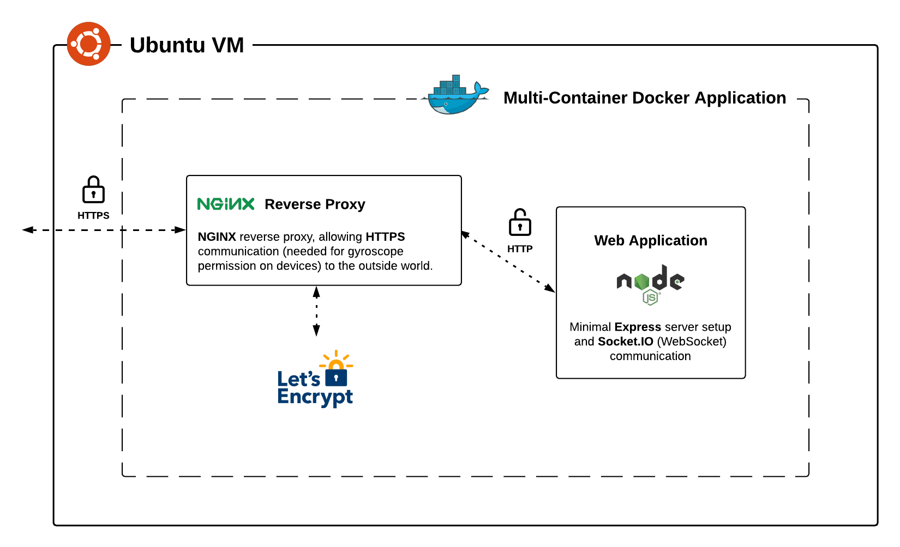

# docker-websocket-experiment #

This project was implemented as part of the study module __Studio Web & Mobile Design 2__.

## Usage ##

Connect multiple devices to the application and choose a role for each of them (screen or controller). Then move the displayed marble from screen to screen by tilting your controller towards the intended direction.

[Play it!](https://docker.fabien-jeckelmann.me/)

## Technologies ##

[`Docker`](https://www.docker.com/) - Deploying containerized applications

[`Express`](https://expressjs.com/) - Node web application framework

[`Socket.IO`](https://socket.io/) - WebSocket library

## Architecture ##



## Documentation ##

The containerized application is hosted as an Ubuntu VM running as [DigitalOcean Droplet](https://www.digitalocean.com/products/droplets/).

- [Install Docker Engine on Ubuntu](https://docs.docker.com/engine/install/ubuntu/)

- [How to build a Node.js application with Docker](https://www.digitalocean.com/community/tutorials/how-to-secure-a-containerized-node-js-application-with-nginx-let-s-encrypt-and-docker-compose)

- [How to secure a containerized Node.js application with Nginx, Let's Encrypt and Docker Compose](https://www.digitalocean.com/community/tutorials/how-to-secure-a-containerized-node-js-application-with-nginx-let-s-encrypt-and-docker-compose)

### Docker ###

```zsh
# build image and name it
docker build -t <image-name>
```

```zsh
# show all images
docker images
```

```zsh
# run container
docker run --name <container-name> -p <container-port>:<app-port> <image-name>
```

```zsh
# list running containers
docker ps
```

```zsh
# stop container
docker stop <container id>
```

```zsh
# remove the stopped container and all the images
docker docker system prune -a
```

### SSH ###

```zsh
# create ssh connection
ssh root@<public ip>
```

### Docker Compose ###

```zsh
# start service
docker-compose up
```

```zsh
# show service status
docker-compose ps
```

```zsh
# stop service
docker-compose stop <service name>
```

```zsh
# build service without starting it
docker-compose build <service name>
```

#### SSL ####

```zsh
# create and save ssl certificate and key
mkdir dhparam
sudo openssl dhparam -out /root/dhparam/dhparam-2048.pem 2048
```

##### Renewing Certificates #####

```zsh
# create renewal script in project directory
nano ssl_renew.sh
```

```zsh
# open root crontab file with nano
sudo crontab -e
```

```zsh
# define execution interval for ssl_renew.sh
0 0 * * * /root/dhparam/ssl_renew.sh >> /var/log/cron.log 2>&1
```

## License ##

[MIT](https://choosealicense.com/licenses/mit/)
